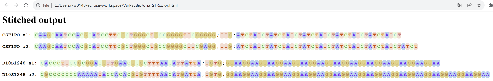

# VarSeqStitcher
A novel bioinformatics software to build and phase long alleles for SNP, STR and InDel from VCF and reference.

Works for any computing system where the Java Run environment is available. The tested systems include:

Windows 10,11

Mac OS 11.6.5

Linux: Ubuntu 20.04, 22.04; Center OS 8

## Installation 
The software can be downloaded for a direct use. No additional compiling and installation.  Get it from Github: 

`git clone https://github.com/XuewenWangUGA/VarSeqStitcher`

or download the zip compressed files and then unzip to VarSeqStitcher

## Update Java run environment if necessary
The sfotware will use the Java runtime environment (SE) V17. If your computer has an old version of Java runtime, please install the newest Java or Java SE Development Kit 17 or higher from https://www.oracle.com/java/technologies/downloads/. Either Java or Java SE should work.

## The latest version 
v1.0

## License
The tool is under the Lesser General Public License v2.1. Free to distribute and improve. Free for all academic and educational purposes. A license is needed to be obtained from us for any industrial and any other purposes. Please contact us.

## Usage:
Open a terminal window and type the following command: the -Xmx4G is for the allowed maximum memory to use, and can be ignored or changed to any memory you needed, e.g., 2G: -Xmx2G

`java -jar -Xmx4G VarSeqStitcher.jar [options]  >out.tsv`

Options:  
    
     -d,--inDelBedFile <arg>      configure file of InDels in BED format in tabular plain text, e.g.: 
                                  Chrom	ChromStart	ChromEnd	REF	ALT	ID
                                  chr1	230764747	230764748	GA	G	D1S1656
                                  chr1	230764749	230764750	T	TC	D1S1656
                                 chr2	1485704	1485705	C	CT	TPOX
                              
     -n,--snpPanelPosFile <arg>   configure file of SNPs in tabular plain text, e.g.  
                                   #CHROM	 POS 	ID	REF	ALT
                                    chr1	230765010	D1S1656	A	G
                                    chr1	230765280	D1S1656	G	A
 
     -r,--referenceSeq <arg>      reference genome sequence file in fasta format, accompanied by an indexed .fai from samtools faidx: eg. hg38.fasta, hg38.fa.fai  
     -s,--strRegion <arg>         STR regions in tabular plain text, 1-based coordinate, one locus per line.  
                                  eg.  Chrom ChromStartPos_Str ChromEndPos_Str Name
                                       chr1 1000 10100 mkName1
                                       chr3 3000 30200 mkName2
    -t,--ThreadNumber <arg>      integer, the number of computing threads, default [1]
    -v,--vcf <arg>               vcf file in .gz and with index gz.tbi from bcftools index --tbi

## Quick start

`java -jar VarSeqStitcher.jar`
       
## Tutorials step by step
Here is an example of how to use this tool for a human for 8-kb regions of 20 CODIS core STR sites.  For your specific genome, you just need to replace the genome and targeted sites in configure files with yours.
Firstly go to the software directory in the command window:

` cd VarSeqStitcher`
       
### Step 1. prepare a genome reference file which should be the one used for vcf generation previously 
Download the genome sequence of human from the 1000 Genome Project to the folder "VarSeqStitcher" 
       ftp://ftp.1000genomes.ebi.ac.uk/vol1/ftp/technical/reference/GRCh38_reference_genome/GRCh38_full_analysis_set_plus_decoy_hla.fa	
or use the command: 

       `wget ftp://ftp.1000genomes.ebi.ac.uk/vol1/ftp/technical/reference/GRCh38_reference_genome/GRCh38_full_analysis_set_plus_decoy_hla.fa`

Then to index the genome sequence with samtools (tool link: https://www.htslib.org/)  

       `samtools faidx GRCh38_full_analysis_set_plus_decoy_hla.fa`
       
       
### Step 2. get test data and targeted site files 
Download the subdirectory `testData` and put it inside the folder "VarSeqStitcher"

### Step 3. run the analysis with the following command
We use the vcf files for human sample HG00130 as the test data. The original files are downloaded from the 1KG project at https://www.internationalgenome.org/data-portal/data-collection/30x-grch38. VCF for all chromosomes are merged and sorted, indexed with bcftools.
       
`java -jar VarSeqStitcher.jar -d testData\MHindels_v0.3.bed -n testData\MHsnps.pos_v0.3.txt -r GRCh38_full_analysis_set_plus_decoy_hla.fa -s testData\CODISSTR_anchor.XW.config_v0.3.txt -v testData\CCDG_14151_B01_GRM_WGS_2020-08-05_AllChr.filtered.shapeit2-duohmm-phased.8000.HG00130.vcf.gz -t 2 >out.tsv`

Here the output will be saved to "out.tsv", which is a tab seperated plain text. You can give any file name as like. If no output file name is given, the output will be directed into standout/screen of the terminal window.

## output: 
### results 1. out.tsv

The output will look like:

    #Total SNP loci in the position file:	965 	Columns:	5
    #Total InDel loci:	52
    #Total loci in STR configure file:	20
    #Marker	AlleleID	Length(bp)	Allele(stitched_and_phased)	CallType	Sample
    #CSF1PO        #150076810,150077208,150077209,150077248,150077432,150077930,150078115,150078547,150078565,150078667,150078700,150078856,150079140,150079167,150079266,150079332,150079368,150079539,150079547,150079796,150079818,150079998,150080011,150080550,150080613,150080780,150080990,150081238,150081390,150081538,150081664,150082349,150082446,150082478,150082618,150083032,150083033,150083645,150083666,150084099,150084113,150084310,150084394,150084398;150079596,150079750,150079977;150076324		
    CSF1PO	a1:	87	C,A,A,G,C,A,A,T,C,C,A,C,G,C,A,T,C,C,T,T,C,G,C,T,G,G,G,C,T,G,C,C,G,G,G,G,T,T,C,G,G,G,G,G;T,T,G;ATCTATCTATCTATCTATCTATCTATCTATCTATCTATCT	vcfcall	HG00130
    CSF1PO	a2:	91	C,A,A,G,C,A,A,T,C,C,A,C,G,C,A,T,C,C,T,T,C,G,C,T,G,G,G,C,T,G,C,C,G,G,G,G,C,T,T,C,G,A,G,G;T,T,G;ATCTATCTATCTATCTATCTATCTATCTATCTATCTATCTATCT	vcfcall	HG00130

for each marker /locus name, there will be three lines for a diploid genome in output: 

line 1: coordinates of each targeted site, e.g. the first two position of CSF1PO will be 150076810,150077208

line 2: DNA sequence of allele 1 at each targeted site (a1): e.g., CSF1PO	a1:	87	C,A

line 3: DNA sequence of allele 2 at each targted site(a2): e.g.,CSF1PO	a2:	91	C,A

The sequence line consists of three sections: SNPs, InDels, and then STR.

the file can be opened in Microsoft Excel or other spreadsheet for easy read.

### results 2. colorful alleles .html

Another result called output .html will be also generated for a colorful display of the alleles. This file will be opened in an internet web browser by default if available.

 Fig.1 Colorful alleles output  

More colorful alleles: download the testOutput/dna_STRcolor.html, then open in your web browser. 

## Citation

Coming soon

## Questions

Please post or contact me if you have any questions.

       

                              
